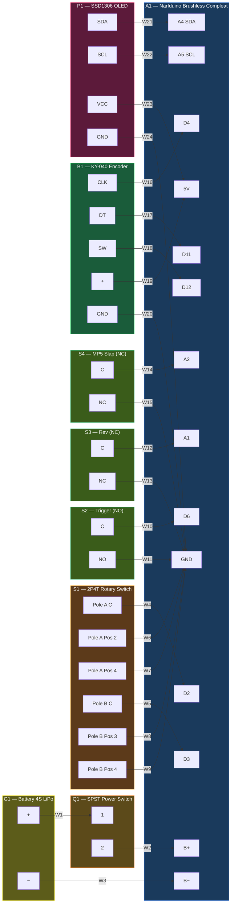

# Phantasm — IEC 60617 Schematic

Reference designations per IEC 81346. Graphical symbol conventions per
IEC 60617.

## Reference Designation Index

| Ref | IEC Symbol | Component | Terminals |
|---|---|---|---|
| **G1** | Battery cell | 4S LiPo battery pack | +, − |
| **Q1** | Switch, SPST | Master power on-off toggle switch | 1, 2 |
| **A1** | Assembly | Narfduino Brushless Compleat (ATmega328P) | B+, B−, D2–D12, A0–A5, 5V, GND |
| **S1** | Rotary switch, 2P4T | Fire mode selector | Pole A (C, 1–4), Pole B (C, 1–4) |
| **S2** | Switch, NO | Trigger microswitch | C, NO |
| **S3** | Switch, NC | Rev (pre-rev) microswitch | C, NC |
| **S4** | Switch, NC | MP5 slap (bolt-lock safety) microswitch | C, NC |
| **B1** | Encoder (transducer) | KY-040 rotary encoder | CLK, DT, SW, +, GND |
| **P1** | Display | 0.96″ I2C SSD1306 OLED (128×64) | SDA, SCL, VCC, GND |

## Schematic

## Wire Schedule

| Wire | From | To | Notes |
|---|---|---|---|
| W1 | G1 + | Q1:1 | Battery positive to power switch |
| W2 | Q1:2 | A1 B+ | Switched power to controller |
| W3 | G1 − | A1 B− | Battery negative direct |
| W4 | S1 Pole A C | A1 D2 | Select 1 signal |
| W5 | S1 Pole B C | A1 D3 | Select 2 signal |
| W6 | S1 Pole A Pos 2 | A1 GND | Single shot select |
| W7 | S1 Pole A Pos 4 | A1 GND | Full auto select (A) |
| W8 | S1 Pole B Pos 3 | A1 GND | Burst select |
| W9 | S1 Pole B Pos 4 | A1 GND | Full auto select (B) |
| W10 | S2 C | A1 D6 | Trigger signal |
| W11 | S2 NO | A1 GND | Trigger return |
| W12 | S3 C | A1 A1 | Pre-rev signal |
| W13 | S3 NC | A1 GND | Pre-rev return |
| W14 | S4 C | A1 A2 | MP5 slap signal |
| W15 | S4 NC | A1 GND | MP5 slap return |
| W16 | B1 CLK | A1 D4 | Encoder clock |
| W17 | B1 DT | A1 D11 | Encoder data |
| W18 | B1 SW | A1 D12 | Encoder push button |
| W19 | B1 + | A1 5V | Encoder power |
| W20 | B1 GND | A1 GND | Encoder return |
| W21 | P1 SDA | A1 A4 | I²C data |
| W22 | P1 SCL | A1 A5 | I²C clock |
| W23 | P1 VCC | A1 5V | Display power |
| W24 | P1 GND | A1 GND | Display return |

## Signal Logic Summary

| Ref | Type | At Rest | Activated | A1 Pin | Logic |
|---|---|---|---|---|---|
| S1 | 2P4T | Open (HIGH) | Closed to GND (LOW) | D2, D3 | 2-bit binary fire mode encoding |
| S2 | NO | Open (HIGH) | Closed to GND (LOW) | D6 | LOW = trigger pressed |
| S3 | NC | Closed to GND (LOW) | Open (HIGH) | A1 | HIGH = pre-rev active |
| S4 | NC | Closed to GND (LOW) | Open (HIGH) | A2 | HIGH = bolt open (unsafe) |
| B1 | Encoder | Idle | Quadrature pulses | D4, D11 | Polled, not interrupt-driven |

## Notes

- All signal inputs on A1 use `INPUT_PULLUP` — no external pull-up
  resistors required.
- Wire gauge: 22–26 AWG for signal lines. Power lines (W1–W3) should be
  rated for battery current (e.g. 16–18 AWG for 4S LiPo).
- Q1 must be rated for full battery voltage and current draw (e.g. 20A
  at 16.8V for a 4S LiPo).
- S4 (MP5 slap) is mechanically identical to S3 (rev) — both are NC
  microswitches wired to GND via the normally closed terminal.
