# Phantasm — Complete Wiring Diagram

## Components Required

| Component | Purpose |
|---|---|
| **SPST On-Off Toggle Switch** | Master power switch — cuts battery power to the board |
| **3-Position 2-Pole Slide Switch (2P3T)** | Selects fire mode (Single / Burst / Full Auto) |
| **Trigger Microswitch** | Already installed — fires darts (wired NO) |
| **Rev Microswitch** | Pre-rev toggle — keeps flywheels idling at low RPM (wired NC) |
| **MP5 Slap Microswitch** | Bolt-lock safety — prevents firing when bolt is open (wired NC) |
| **KY-040 Rotary Encoder** | Adjusts parameters — button cycles: RPM → Burst → Pre-Rev |
| **0.96" I2C SSD1306 OLED** (128×64, 5V tolerant) | Displays fire mode, RPM, burst count, and pre-rev status |
| **Hook-up wire** | 22–26 AWG signal wire |

## Select Fire Switch Type

You need a 6-pin **2-pole 3-position slide switch** in the common
**ON‑OFF‑ON** (centre-off) layout — two rows of three pins, with the middle
pin of each row as the pole common. In this style the centre slider position
makes no contact on either pole. Two pins (D2 and D3) with `INPUT_PULLUP`
then encode 3 fire modes:

* **Pos 1 (left)**   → D2 LOW, D3 HIGH → **Single**
* **Pos 2 (centre)** → D2 HIGH, D3 HIGH → **Burst** (both poles open)
* **Pos 3 (right)**  → D2 LOW, D3 LOW → **Full Auto**

The `HIGH/LOW` combination is unreachable with this wiring; the sketch
defaults defensively to **Single** if it ever occurs. Safety is handled
separately by the MP5 slap switch. The fire-mode read is debounced for 40 ms
so quick slides across the centre position do not flicker through Burst.

## Wiring Diagram (Mermaid)

```mermaid
graph TD
    subgraph BAT["LiPo Battery"]
        BPOS["B+ (Positive)"]
        BNEG["B− (Negative)"]
    end

    subgraph PWR["SPST On-Off Toggle Switch"]
        PWRIN["Terminal 1 (Battery B+)"]
        PWROUT["Terminal 2 (NBC B+)"]
    end

    subgraph NBC["Narfduino Brushless Compleat"]
        NBCBPOS["B+ pad"]
        NBCBNEG["B− pad"]
        D2["D2 — PIN_SELECT_1"]
        D3["D3 — PIN_SELECT_2"]
        A3["A3 — PIN_ENCODER_CLK"]
        D6["D6 — PIN_TRIGGER"]
        A2["A2 — PIN_MP5_SLAP"]
        D11["D11 — PIN_ENCODER_DT"]
        D12["D12 — PIN_ENCODER_SW"]
        A1["A1 — PIN_PRE_REV"]
        A4["A4 — SDA"]
        A5["A5 — SCL"]
        VCC["5V"]
        GND["GND pad"]
    end

    subgraph SW["2P3T Slide Switch (ON-OFF-ON)"]
        direction TB
        P1C["Pole A — Common"]
        P1_1["Pole A — Pos 1 (left)"]
        P1_3["Pole A — Pos 3 (right)"]
        P2C["Pole B — Common"]
        P2_3["Pole B — Pos 3 (right)"]
    end

    subgraph TRIG["Trigger Microswitch (NO)"]
        TC["Common"]
        TNO["Normally Open"]
    end

    subgraph REV["Rev Microswitch (NC)"]
        RC["Common"]
        RNC["Normally Closed"]
    end

    subgraph MP5["MP5 Slap Microswitch (NC)"]
        MC["Common"]
        MNC["Normally Closed"]
    end

    subgraph ENC["KY-040 Rotary Encoder"]
        ECLK["CLK"]
        EDT["DT"]
        ESW["SW"]
        EVCC["+ (VCC)"]
        EGND["GND"]
    end

    subgraph OLED["I2C SSD1306 OLED"]
        OSDA["SDA"]
        OSCL["SCL"]
        OVCC["VCC"]
        OGND["GND"]
    end

    BPOS -->|"wire"| PWRIN
    PWROUT -->|"wire"| NBCBPOS
    BNEG -->|"wire"| NBCBNEG

    P1C -->|"wire"| D2
    P2C -->|"wire"| D3
    P1_1 -->|"wire"| GND
    P1_3 -->|"wire"| GND
    P2_3 -->|"wire"| GND

    TC -->|"wire"| D6
    TNO -->|"wire"| GND

    RC -->|"wire"| A1
    RNC -->|"wire"| GND

    MC -->|"wire"| A2
    MNC -->|"wire"| GND

    ECLK -->|"wire"| A3
    EDT -->|"wire"| D11
    ESW -->|"wire"| D12
    EVCC -->|"wire"| VCC
    EGND -->|"wire"| GND

    OSDA -->|"wire"| A4
    OSCL -->|"wire"| A5
    OVCC -->|"wire"| VCC
    OGND -->|"wire"| GND

    style BAT fill:#5c5c1a,stroke:#ffee36,color:#ffffff
    style PWR fill:#5c4a1a,stroke:#ff8c36,color:#ffffff
    style NBC fill:#1a3a5c,stroke:#4a8eff,color:#ffffff
    style SW fill:#5c3a1a,stroke:#ffb236,color:#ffffff
    style TRIG fill:#3a5c1a,stroke:#30b570,color:#ffffff
    style REV fill:#3a5c1a,stroke:#30b570,color:#ffffff
    style MP5 fill:#3a5c1a,stroke:#30b570,color:#ffffff
    style A1 fill:#2a4a6c,stroke:#4a8eff,color:#ffffff
    style A2 fill:#2a4a6c,stroke:#4a8eff,color:#ffffff
    style ENC fill:#1a5c3a,stroke:#36ff72,color:#ffffff
    style OLED fill:#5c1a3a,stroke:#ff3672,color:#ffffff
    style D2 fill:#2a4a6c,stroke:#4a8eff,color:#ffffff
    style D3 fill:#2a4a6c,stroke:#4a8eff,color:#ffffff
    style A3 fill:#2a4a6c,stroke:#4a8eff,color:#ffffff
    style D6 fill:#2a4a6c,stroke:#4a8eff,color:#ffffff
    style D11 fill:#2a4a6c,stroke:#4a8eff,color:#ffffff
    style D12 fill:#2a4a6c,stroke:#4a8eff,color:#ffffff
    style A4 fill:#2a4a6c,stroke:#4a8eff,color:#ffffff
    style A5 fill:#2a4a6c,stroke:#4a8eff,color:#ffffff
    style VCC fill:#2a4a6c,stroke:#30b570,color:#ffffff
    style GND fill:#2a4a6c,stroke:#ff5062,color:#ffffff
```

## Pin-to-Wire Summary

| NBC Pad | Connects To |
|---|---|
| **B+** | On-off switch Terminal 2 (other terminal to battery B+) |
| **B−** | Battery B− (direct) |
| **D2** | Slide switch — Pole A Common |
| **D3** | Slide switch — Pole B Common |
| **A3** | Rotary encoder — CLK |
| **D6** | Trigger microswitch — Common |
| **A1** | Rev microswitch — Common |
| **A2** | MP5 slap microswitch — Common |
| **D11** | Rotary encoder — DT |
| **D12** | Rotary encoder — SW (push button) |
| **A4** | OLED — SDA |
| **A5** | OLED — SCL |
| **5V** | Rotary encoder VCC, OLED VCC |
| **GND** | Slide switch terminals, Trigger NO, Rev NC, MP5 Slap NC, Encoder GND, OLED GND |

## Fire Mode Truth Table

| Position | Pole A (D2) | Pole B (D3) | Fire Mode |
|---|---|---|---|
| **1 (left)** | Closed → LOW | Open → HIGH | **Single Shot** |
| **2 (centre)** | Open → HIGH | Open → HIGH | **3-Round Burst** |
| **3 (right)** | Closed → LOW | Closed → LOW | **Full Auto** |
| **Defensive** | Open → HIGH | Closed → LOW | **Single Shot** (unreachable with this wiring) |

## Slide Switch Wiring Detail

The switch is an **ON‑OFF‑ON** 2P3T slide switch (6 pins total, two rows of
three). The middle pin of each row is that pole's common. The centre slider
position makes no contact on either pole, so only the outer throw pins are
wired. Solder as follows:

| Physical pin | Role | Connects to |
|---|---|---|
| Row A — middle | Pole A Common | **D2** |
| Row A — left   | Pole A throw 1 | **GND** |
| Row A — right  | Pole A throw 3 | **GND** |
| Row B — middle | Pole B Common | **D3** |
| Row B — left   | Pole B throw 1 | **Not connected** |
| Row B — right  | Pole B throw 3 | **GND** |

With this wiring, Pos 1 grounds only D2, Pos 3 grounds both D2 and D3, and
Pos 2 (centre-off) leaves both floating HIGH — which the sketch interprets
as **Burst**.

## Notes

- The **on-off switch** is wired in-line on the battery positive lead. When
  off, no power reaches the board. Use a switch rated for your battery
  voltage and current (e.g. 20A for a 4S LiPo).
- All select pins use `INPUT_PULLUP` — no external resistors needed.
- The **trigger microswitch** uses the **Normally Open (NO)** terminal.
  At rest the pin is HIGH (pullup); pressing the trigger closes the
  circuit to GND, pulling the pin LOW.
- The **rev microswitch** uses the **Normally Closed (NC)** terminal.
  At rest the pin is LOW (closed to GND); activating the switch opens
  the circuit, and the pullup pulls the pin HIGH to enable pre-rev.
- The **MP5 slap microswitch** uses the **Normally Closed (NC)** terminal.
  At rest (bolt locked) the pin is LOW (closed to GND); when the bolt is
  open the switch opens and the pullup pulls the pin HIGH. Firing is
  disabled whenever the pin reads HIGH, regardless of the fire-mode selector
  position.
- When a pin is not connected to GND, the internal pull-up holds it HIGH.
- Refer to `NBC-Pinout.png` for physical pad locations on your board.
