# Phantasm — Complete Wiring Diagram

## Components Required

| Component | Purpose |
|---|---|
| **4-Position 2-Pole Rotary Switch (2P4T)** | Selects fire mode (Safety / Single / Burst / Full Auto) |
| **Trigger Microswitch** | Already installed — fires darts |
| **KY-040 Rotary Encoder** | Adjusts flywheel RPM (3000–8000 in 250 RPM steps) |
| **0.96" I2C SSD1306 OLED** (128×64, 5V tolerant) | Displays current fire mode and RPM |
| **Hook-up wire** | 22–26 AWG signal wire |

## Select Fire Switch Type

You need a **2-pole 4-position (2P4T) rotary switch**. This has 2 independent
poles (A and B), each with a common terminal and 4 selectable positions.
Two pins (D2 and D3) are used with `INPUT_PULLUP` to encode 4 fire modes
in binary.

> ⚠️ Do **not** use a 3-position toggle switch — it cannot produce all 4
> fire mode combinations needed for Safety, Single, Burst, and Full Auto.

## Wiring Diagram (Mermaid)

```mermaid
graph TD
    subgraph NBC["Narfduino Brushless Compleat"]
        D2["D2 — PIN_SELECT_1"]
        D3["D3 — PIN_SELECT_2"]
        D4["D4 — PIN_ENCODER_CLK"]
        D6["D6 — PIN_TRIGGER"]
        D11["D11 — PIN_ENCODER_DT"]
        D12["D12 — PIN_ENCODER_SW"]
        A4["A4 — SDA"]
        A5["A5 — SCL"]
        VCC["5V"]
        GND["GND pad"]
    end

    subgraph SW["4-Position 2P4T Rotary Switch"]
        direction TB
        P1C["Pole A — Common"]
        P1_1["Pole A — Pos 2 (Single)"]
        P1_3["Pole A — Pos 4 (Full Auto)"]
        P2C["Pole B — Common"]
        P2_1["Pole B — Pos 3 (Burst)"]
        P2_3["Pole B — Pos 4 (Full Auto)"]
    end

    subgraph TRIG["Trigger Microswitch"]
        TC["Common"]
        TNO["Normally Open"]
    end

    subgraph ENC["KY-040 Rotary Encoder"]
        ECLK["CLK"]
        EDT["DT"]
        ESW["SW"]
        EVCC["+ (VCC)"]
        EGND["GND"]
    end

    subgraph OLED["I2C SSD1306 OLED"]
        OSDA["SDA"]
        OSCL["SCL"]
        OVCC["VCC"]
        OGND["GND"]
    end

    P1C -->|"wire"| D2
    P2C -->|"wire"| D3
    P1_1 -->|"wire"| GND
    P1_3 -->|"wire"| GND
    P2_1 -->|"wire"| GND
    P2_3 -->|"wire"| GND

    TC -->|"wire"| D6
    TNO -->|"wire"| GND

    ECLK -->|"wire"| D4
    EDT -->|"wire"| D11
    ESW -->|"wire"| D12
    EVCC -->|"wire"| VCC
    EGND -->|"wire"| GND

    OSDA -->|"wire"| A4
    OSCL -->|"wire"| A5
    OVCC -->|"wire"| VCC
    OGND -->|"wire"| GND

    style NBC fill:#1a3a5c,stroke:#4a8eff,color:#ffffff
    style SW fill:#5c3a1a,stroke:#ffb236,color:#ffffff
    style TRIG fill:#3a5c1a,stroke:#30b570,color:#ffffff
    style ENC fill:#1a5c3a,stroke:#36ff72,color:#ffffff
    style OLED fill:#5c1a3a,stroke:#ff3672,color:#ffffff
    style D2 fill:#2a4a6c,stroke:#4a8eff,color:#ffffff
    style D3 fill:#2a4a6c,stroke:#4a8eff,color:#ffffff
    style D4 fill:#2a4a6c,stroke:#4a8eff,color:#ffffff
    style D6 fill:#2a4a6c,stroke:#4a8eff,color:#ffffff
    style D11 fill:#2a4a6c,stroke:#4a8eff,color:#ffffff
    style D12 fill:#2a4a6c,stroke:#4a8eff,color:#ffffff
    style A4 fill:#2a4a6c,stroke:#4a8eff,color:#ffffff
    style A5 fill:#2a4a6c,stroke:#4a8eff,color:#ffffff
    style VCC fill:#2a4a6c,stroke:#30b570,color:#ffffff
    style GND fill:#2a4a6c,stroke:#ff5062,color:#ffffff
```

## Pin-to-Wire Summary

| NBC Pad | Connects To |
|---|---|
| **D2** | Rotary switch — Pole A Common |
| **D3** | Rotary switch — Pole B Common |
| **D4** | Rotary encoder — CLK |
| **D6** | Trigger microswitch — Common |
| **D11** | Rotary encoder — DT |
| **D12** | Rotary encoder — SW (push button) |
| **A4** | OLED — SDA |
| **A5** | OLED — SCL |
| **5V** | Rotary encoder VCC, OLED VCC |
| **GND** | Rotary switch terminals, Trigger NO, Encoder GND, OLED GND |

## Fire Mode Truth Table

| Position | Pole A (D2) | Pole B (D3) | Fire Mode |
|---|---|---|---|
| **1** | Open → HIGH | Open → HIGH | **Safety** |
| **2** | Closed → LOW | Open → HIGH | **Single Shot** |
| **3** | Open → HIGH | Closed → LOW | **3-Round Burst** |
| **4** | Closed → LOW | Closed → LOW | **Full Auto** |

## Rotary Switch Wiring Detail

The 2P4T rotary switch has 2 poles (A and B), each with a common pin and
4 position pins. Wire the positions to GND as follows:

| Terminal | Connects To |
|---|---|
| Pole A — Common | D2 |
| Pole A — Position 1 | Not connected (D2 stays HIGH) |
| Pole A — Position 2 | GND (pulls D2 LOW) |
| Pole A — Position 3 | Not connected (D2 stays HIGH) |
| Pole A — Position 4 | GND (pulls D2 LOW) |
| Pole B — Common | D3 |
| Pole B — Position 1 | Not connected (D3 stays HIGH) |
| Pole B — Position 2 | Not connected (D3 stays HIGH) |
| Pole B — Position 3 | GND (pulls D3 LOW) |
| Pole B — Position 4 | GND (pulls D3 LOW) |

## Notes

- All select pins use `INPUT_PULLUP` — no external resistors needed.
- Switches connect pins to **GND** to pull them LOW (active).
- When a pin is not connected to GND, the internal pull-up holds it HIGH.
- Refer to `NBC-Pinout.png` for physical pad locations on your board.
